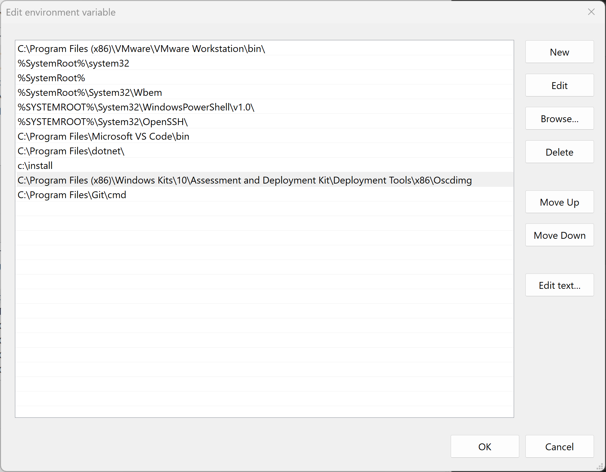

# Create a Windows 11 VM in Hyper-V with Packer

Download the Windows 11 ISO and save the ISO to the following location:  c:\iso
Example: https://www.ivobeerens.nl/2021/05/19/quick-tip-download-the-latest-windows-10-iso-file/

Get the hash of the ISO file with the Powershell get-filehash command

Change the windows-auto-pkvars.hcl file and adjust the variables

Install the Windows Assesment and Deployment Kit (32-bits version) for the 

C:\Program Files (x86)\Windows Kits\10\Assessment and Deployment Kit\Deployment Tools\x86\Oscdimg

Adjust the system variable

