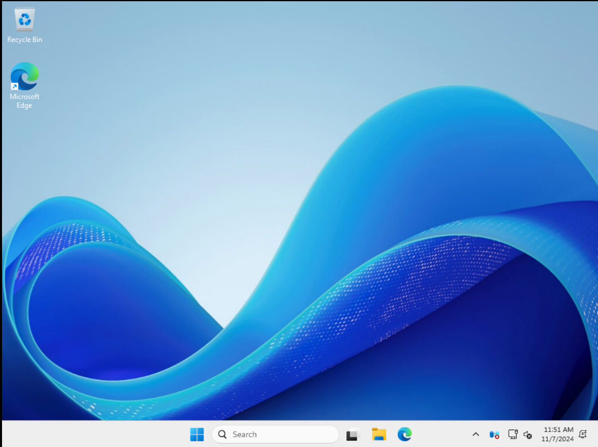

# Packer Configuration for Windows Server 2025

This configuration creates a virtual machine (VM) within VMware ESXi 8 running Windows Server 2025 with Desktop Experience enabled.



## Key Features: 
- Operating System: Microsoft Windows Server 2025 (64-bit)
- Hardware:
    - **vCPUs:** 2
    - **Memory:** 4 GB
    - **Disk:** 100 GB (thin provisioned)
    - **Virtualization-Based Security (VBS):** Enabled
    - **Network Adapter:** VMXNET3
- The latest Windows Updates are installed.
- VMware Compatibility: Tested with VMware vSphere 8 (Hardware version 21)
- The VMware PVSCSI (VMware Paravirtual) driver is included in the Windows Server 2025 ISO image, there is no need to select or install the PVSCSI driver from additional media now.
- VMware Tools: Automatically installed (version 12.5.0 with day-zero support for Windows Server 2025)
- Remote Access: OpenSSH (default in Windows Server 2025) used by Packer (instead of using WINRM).
- Package Management: WinGet is fully supported for easy software installation and updates (e.g., ```Winget Upgrade -all```)

## Notes:
- Refer to the hardware requirements for Windows Server 2025 for optimal performance: [link](https://learn.microsoft.com/en-us/windows-server/get-started/hardware-requirements?tabs=ram&pivots=windows-server-2025)
- Adjust the variables file in (```win2025-std.auto.pkvars.hcl```) to customize the VM configuration according to your needs. 
- If Windows Server 2025 (64-bit) is unavailable (depends on the VMware ESXi version) use Microsoft Windows Server 2022 (64-bit) as Guest OS. This can be checked using the following script [link](https://github.com/ibeerens/PowerCLI/blob/master/esxi-list-available-osguests-ids.ps1)

## Configuration
1. Download the latest Packer binary. [link](https://www.ivobeerens.nl/2023/09/22/download-the-latest-hashicorp-terraform-packer-and-vault-bits/)
2. Adjust the variables in the ```win2025-std.auto.pkvars.hcl``` file
3. Adjust the passwords in the ```autounattended.xml``` (lines 138 and 177)
4. Adjust the passwords in locals in the ```win2025-std.config.pkr.hcl```. Make sure the SSHUser and SSHPass match the username and password in the ```autounattended.xml file```.
5. The KMS keys for Windows Server 2025 can be found here: [link](https://learn.microsoft.com/en-us/windows-server/get-started/kms-client-activation-keys?tabs=server2025%2Cwindows1110ltsc%2Cversion1803%2Cwindows81)
6. Adjust the variables and run the commands in the ```build.ps1``` file